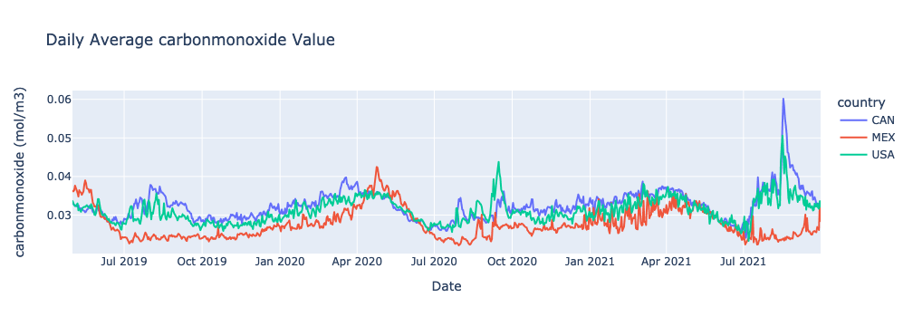
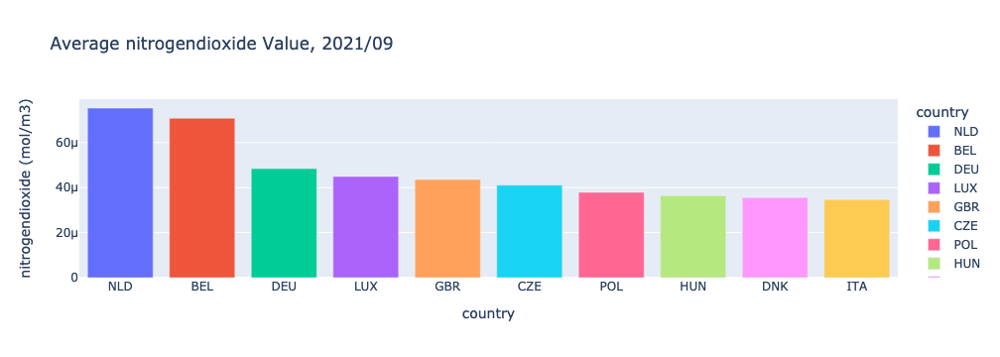

Braden Taack
### Emissions Engineering Project MVP
#### October 12th, 2021
___

#### MVP
  
The problem of global emissions and air quality are a growing issue as the demand for energy and other resources rise every year. It is a complicated matter and even more difficult without clear, interpretable data. My goal is to leverage satellite air quality data into a user-friendly, interactive dashboard. This should allow the user to easily sort through different countries and locations and find a recent history on the air quality data. 

The data has been sourced from the [Emissions API](https://emissions-api.org/), created by the Emissions-API group. Per their page, "The European Space Agency’s Sentinel-5P satellite is built to monitor air quality data (carbon hydroxide, sulfur monoxide, ozone, …). All data gathered are publicly available... Emissions API’s mission is to provide easy access to this data without the need of being an expert in satellite data analysis and without having to process terabytes of data yourself."

So far, 153,878 data points have been collected for 61 countries in North America and Europe for 4 compounds: CH4, CO, O3, and NO2. The date range for the data is 2019/05/01 to 2021/10/01. No data was available prior to May 2019 for all 4 compounds from the API. 

The data was initially stored into a mongoDB, due to the easy json formatting from the API. A pipeline was created to extract the data from the mongoDB and translate it into a more user-friendly pandas dataframe. The data was cleaned while in the pandas dataframe. 

The dashboard is still under development, but below are several charts that may be expected on the final product:

  

#### Further Work  
The main work remaining is to complete the Streamlit application locally and then to push it to Heroku for all to be seen. Features of the dashboard will include a drop down menu to select a country for the line charts, some quick fun facts on max, mins, etc for country air quality data, and a bar chart for the worst air qualities of the last month. 

Another neat feature would be to include an updatable element to the project. The Emissions API produces new data every few days, so it would be nice to continuously update the database. However, this will only be attempted should time allow it. 
